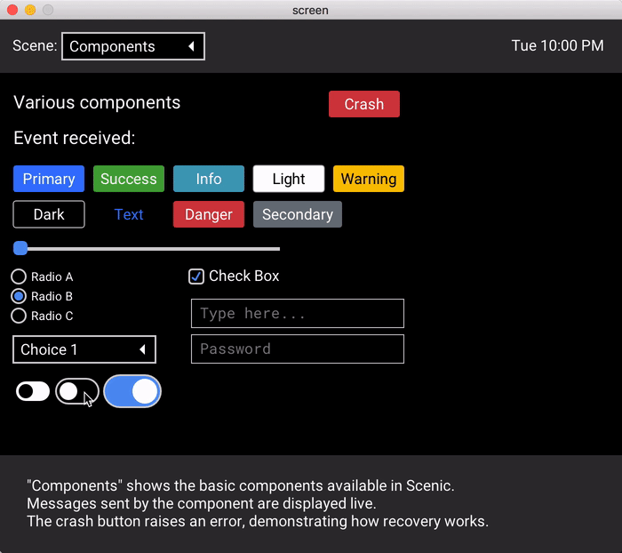

# ScenicToggle

A toggle component for use in Scenic interfaces



See full [documentation on hex](https://hexdocs.pm/scenic_toggle).

## Installation

Add `scenic_toggle` to your list of dependencies in `mix.exs`:

```elixir
def deps do
  [
    {:scenic_toggle, "~> 0.1.0"}
  ]
end
```
